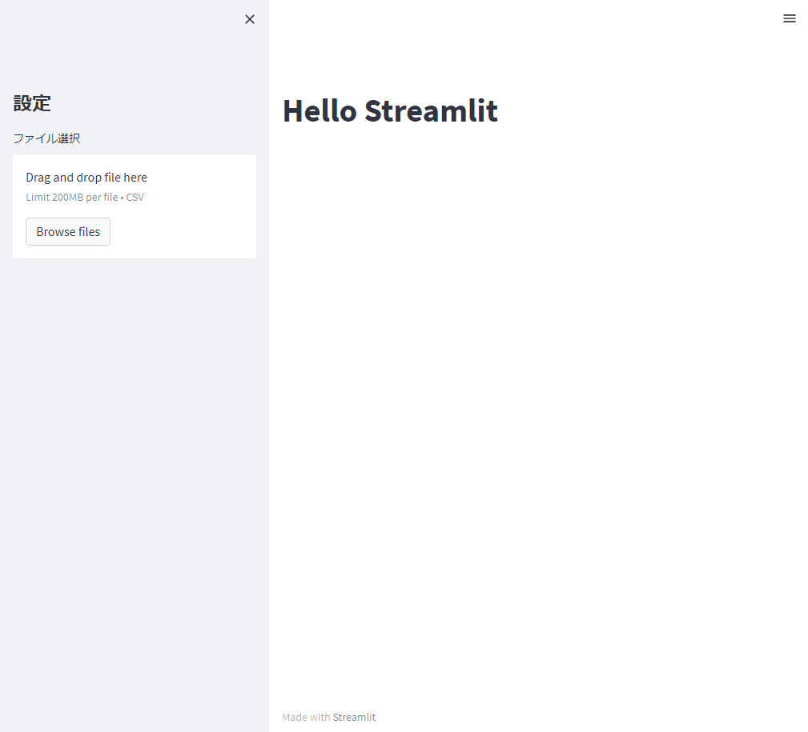

## 目次
- [目次](#目次)
- [環境構築](#環境構築)
- [streamlit とは？](#streamlit-とは)
## 環境構築

```
pip install streamlit
streamlit hello
```
<a id="env"></a>
## streamlit とは？

<a href="https://streamlit.io/">streamlit</a>とは Web アプリケーションを開発するためのフレームワークの 1 つである。UI の構築を HTML や CSS を用いることなく実装することができ、機械学習などのデータサイエンスを用いたアプリの開発向けになっている。

ウィジェットを容易に実装することができ、

```Python
st.title('Hello Streamlit')
st.sidebar.title("設定")
uploaded_file = st.sidebar.file_uploader("ファイル選択", type="csv")
```

と記述すると図1のようになります。

<figure style="text-align:center;">

<figcaption>
図1 streamlit を用いたウィジェットの実装例
</figcaption>
</figure>